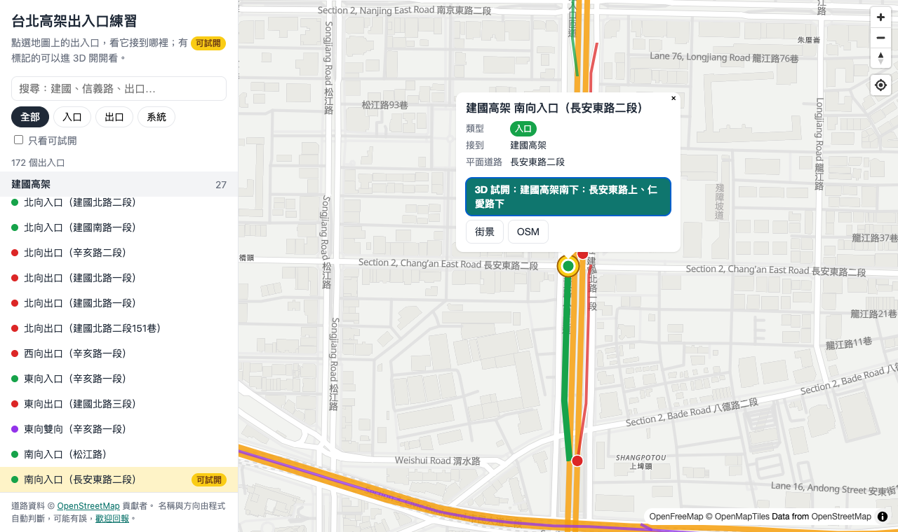
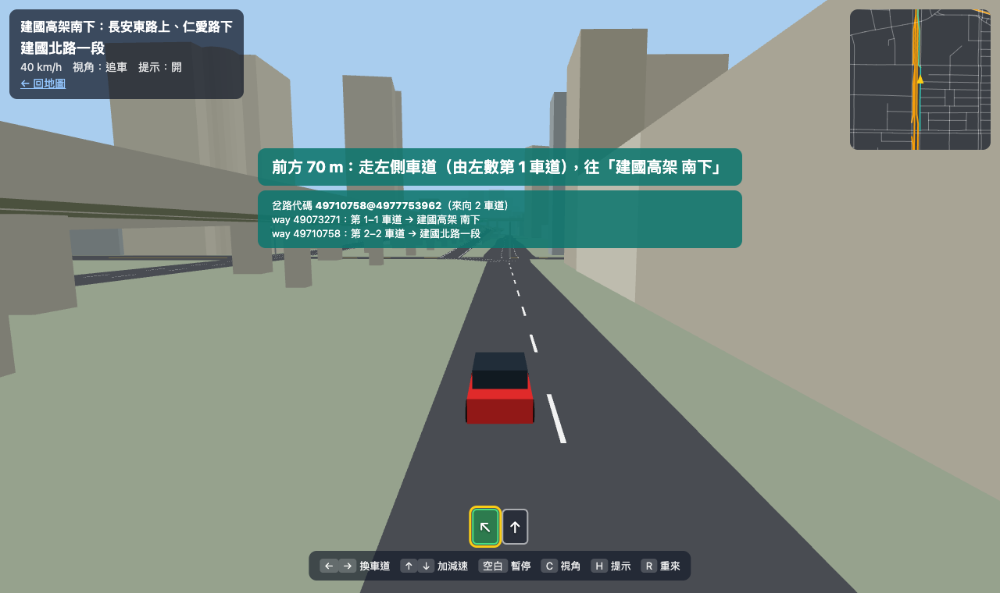

# 台北高架出入口練習

在真的上路前，先用 3D 熟悉台北各個高架、快速道路的出入口怎麼開，避免開錯。

- **地圖**：台北市 172 個高架／快速道路／國道出入口，點選可看接到哪裡、街景連結。
- **3D 試開**：車子自動沿路前進，你只要決定車道；在岔路走錯車道就會開錯，系統會告訴你正確做法。
- 目前可試開：**建國高架南下（長安東路上、仁愛路下）**。

網站：https://susutw.github.io/taipei-ramp-sim/

| 地圖 | 3D 試開 |
|---|---|
|  |  |

> ⚠️ 道路模型、車道分配與指示牌文字都是從開放資料自動產生的，可能和現場不同。實際開車請以現場標誌為準。

## 想幫忙？

很多工作需要「人」去確認現場，不需要會寫程式。請看標籤為
[`需要人工`](https://github.com/susutw/taipei-ramp-sim/issues?q=is%3Aissue+is%3Aopen+label%3A%E9%9C%80%E8%A6%81%E4%BA%BA%E5%B7%A5) 的 issue，每一張都寫了要做什麼、怎麼做、做完交什麼。

## 在本機執行

不需要安裝套件，只要有 Python 3（macOS 內建）：

```sh
python3 -m http.server 8931 --bind 127.0.0.1
# 打開 http://127.0.0.1:8931/
```

試開頁的網址參數：

| 參數 | 用途 |
|---|---|
| `s=<任務 id>` | 選擇任務（見 `data/scenarios.json`） |
| `debug=1` | 顯示岔路代碼與各去向的 way id，人工校對用 |
| `auto=1` | 自動駕駛走正確路線（測試用） |
| `fast=1` | 時間加速 4 倍（測試用） |

鍵盤：`← →` 換車道、`↑ ↓` 加減速、`空白` 暫停、`C` 切換視角、`H` 開關提示、`R` 重來。手機用畫面下方按鈕。

## 運作方式

```
OpenStreetMap ──Overpass──▶ data/raw/*.json
                              │
      scripts/build-ramps.mjs ├──▶ data/ramps.geojson、data/mainlines.geojson ──▶ 地圖（index.html）
      scripts/build-scene.mjs └──▶ data/scenes/<場景>.json ──────────────────────▶ 3D 試開（drive.html）
                                          ▲
              人工校對：data/overrides/ramps.json、data/forks.json
```

- **出入口分組**（`build-ramps.mjs`）：相連的 `*_link` 匝道段視為同一個出入口，看兩端接在主線或平面道路，判斷是入口、出口或系統匝道；方向由主線在接點的走向判斷。
- **3D 場景**（`build-scene.mjs`）：OSM 沒有道路高度，只有上下層關係（`layer`、`bridge`）。高架主線固定在 `layer × 8 m`，平面道路為 0，匝道與引道用相鄰節點平滑內插出坡度。路寬來自 `lanes`，建物高度來自 `height` 或 `building:levels`。
- **岔路與車道**（`src/drive/graph.js`）：在岔路依各去向的車道數，由左到右分配車道；指示牌文字來自 OSM 的 `destination` 或道路名稱。人工校對過的岔路（`data/forks.json`）優先採用。

### 更新資料

```sh
npm run data            # 重抓全台北出入口並產生 data/ramps.geojson
npm run scene:jianguo   # 重抓建國高架周邊並產生 data/scenes/jianguo.json
```

Overpass 伺服器忙碌時會自動重試、換備用伺服器。

### 新增一個試開任務

1. 寫一個 `data/raw/scene-<名稱>.overpassql`（照 `scene-jianguo.overpassql` 改範圍），執行 `scripts/fetch-osm.sh` 與 `node scripts/build-scene.mjs <名稱>`。
2. 在 `data/scenarios.json` 加一筆：
   - `ramp`：地圖上的出入口 id（地圖網址 `#` 後面那串）
   - `start.node`：起點附近的 OSM node id；`start.back`：從那裡往回退幾公尺開始
   - `allowNames`：路線會經過的道路名稱（走到其他道路就算開錯）
   - `goalWays`：終點的 way id
3. 用 `?auto=1&fast=1` 確認自動駕駛能成功抵達，再執行 `npm run test:e2e`。

### 測試

```sh
npm install
npm run serve           # 另一個終端機
npm run test:e2e        # 需要 Chromium；可用 CHROMIUM_PATH 指定
```

## 授權

- 程式碼：MIT
- 道路與建物資料：© [OpenStreetMap](https://www.openstreetmap.org/copyright) 貢獻者，以 ODbL 授權
- 底圖：[OpenFreeMap](https://openfreemap.org/)
